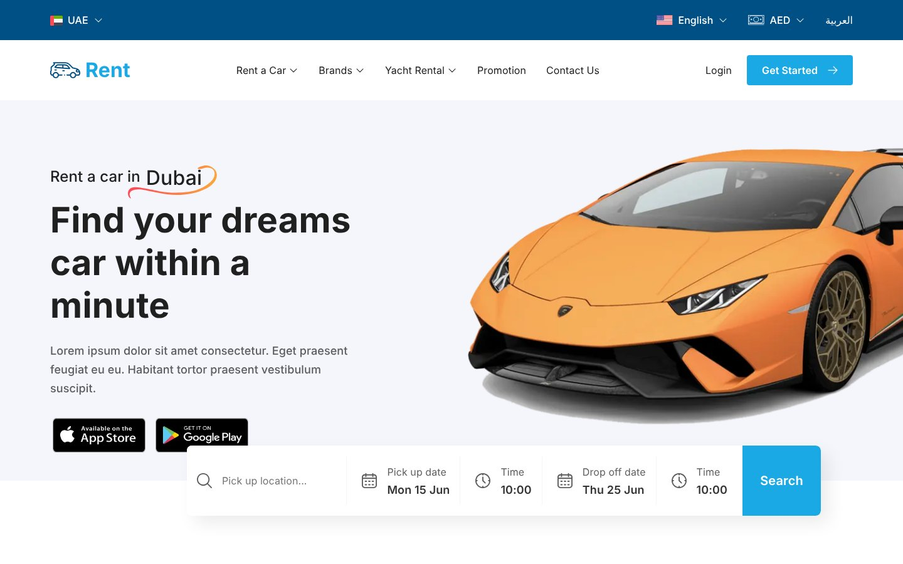

<div align="center">

# Rent — Rent a Car Website (Next.js + Tailwind CSS)

A modern **car rental website template** for Dubai — search by location and date, browse cars by category, book with or without a driver. Pixel-perfect from Figma, built with Next.js, TypeScript and Tailwind CSS. Fully responsive and SEO-ready.

[](https://rent-a-car-website-eight.vercel.app)




</div>

## ✨ Features

- ✅ Hero search bar — pick-up location, pick-up / drop-off date and time
- ✅ Statistics band and car category grid (Luxury, Sports, SUV…) with city selector
- ✅ Car booking carousel, offer banner and "experience" feature section
- ✅ Testimonials slider, FAQ accordion and app-download CTA
- ✅ Country, language (English / Arabic) and currency (AED) switchers
- ✅ SEO: metadata, Open Graph image, favicon set, sitemap, robots and JSON-LD
- ✅ Responsive layout for mobile, tablet and laptop

## 🛠 Tech Stack

Next.js (App Router) · TypeScript · Tailwind CSS · React · Vercel

## Getting started

```bash
npm install
npm run dev      # http://localhost:3000
npm run build    # production build
npm run lint
```

---

## 👤 Designer & Developer

**Noor Hossain** — UI/UX Designer & Front-End Developer (Next.js, React, Tailwind CSS) based in Dhaka, Bangladesh. I design in Figma and ship pixel-perfect, responsive, SEO-friendly websites.

[](https://wa.me/8801913264543)
[](https://www.linkedin.com/in/noorxtk/)
[](https://www.behance.net/noorxtk)
[](https://dribbble.com/Noorxtk)
[](https://github.com/nooruiux)

💼 **Available for freelance:** car rental & booking websites, landing pages, SaaS websites, Figma-to-Next.js builds, UI/UX design. ⭐ Star this repo if it helped you.

<sub>Keywords: car rental website, rent a car template, car booking website, Next.js car rental, Tailwind CSS website, Dubai car rental UI, Figma to code, UI/UX design, responsive web design.</sub>
